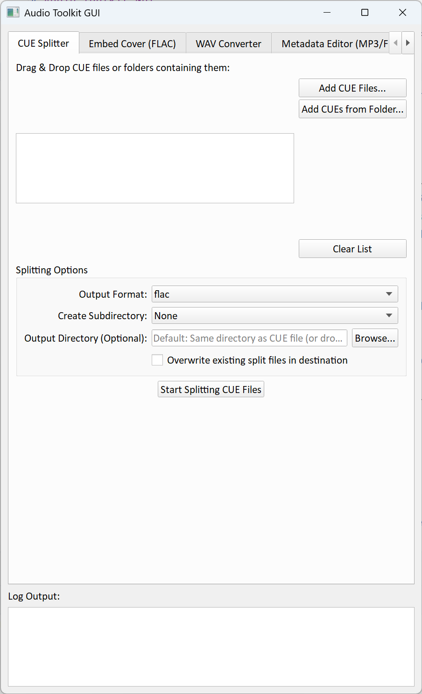

# Audio Toolkit GUI

A Python application with a graphical user interface (GUI) for performing various audio processing tasks, including CUE sheet splitting, WAV to FLAC conversion, metadata editing, and FLAC cover art embedding.



## Features

*   **CUE Sheet Splitting:**
    *   Splits a single audio file based on a `.cue` sheet into individual tracks.
    *   Supports various output formats (FLAC, WAV, MP3, OGG, Opus, Copy).
    *   Optional collection directory creation (e.g., `Artist/Album`).
    *   Automatic cleanup of the original CUE file, main audio file, accompanying `.log` file, and `ffcuesplitter.log` after successful splitting.
    *   Requires `ffcuesplitter`, `FFmpeg`, and `FFprobe`.
*   **WAV to FLAC Conversion:**
    *   Losslessly converts `.wav` audio files to `.flac`.
    *   Option to simply convert or to attempt copying metadata and cover art from a sibling `.mp3` file (if one exists with the same base name).
    *   Requires `FFmpeg` and `mutagen`.
*   **Metadata Editor:**
    *   Edit common metadata tags (Artist, Album Artist, Album, Title, Genre, Year, Track Number, Disc Number, Composer, Comment) for `.mp3` and `.flac` files.
    *   View existing metadata for single selected files.
    *   View common metadata values for multiple selected files.
    *   Explicit "Clear" button for each tag to mark it for deletion.
    *   Changes are applied to all currently selected files.
    *   Requires `mutagen`.
*   **FLAC Cover Art Embedding:**
    *   Embeds cover art images into `.flac` files within a specified folder (and its subfolders).
    *   Prioritizes downloading a cover from a provided URL.
    *   Falls back to searching for a local cover image file (e.g., `cover.jpg`, `cover.png`) in each FLAC's directory if no URL is provided or download fails.
    *   Requires `FFmpeg`, `mutagen`, and `requests`.
*   **File & Folder Drag-and-Drop:** Easily add files or recursively scan folders by dragging them onto the respective file lists in the CUE Splitter, WAV Converter, and Metadata Editor tabs.
*   **Background Processing:** All major operations run in separate threads to keep the user interface responsive.
*   **Logging:** Detailed progress and error messages are displayed in a dedicated log area within the application.


## Installation

### Prerequisites

1.  **Python 3.6+:** Download and install Python from [python.org](https://www.python.org/downloads/). Make sure to check the option to "Add Python to PATH" during installation.
2.  **FFmpeg and FFprobe:** These command-line tools are essential for several operations (splitting, conversion, cover embedding).
    *   Download FFmpeg from [ffmpeg.org](https://ffmpeg.org/download.html).
    *   Install them and ensure the directory containing `ffmpeg.exe` (Windows) or `ffmpeg` (Linux/macOS) is added to your system's **PATH** environment variable. You can verify this by opening a terminal/command prompt and typing `ffmpeg -version` and `ffprobe -version`.
3.  **Git:** (Optional, but recommended for cloning) Download Git from [git-scm.com](https://git-scm.com/downloads).

### Cloning the Repository

```bash
git clone https://github.com/bai0012/audio_toolkit_gui
cd audio_toolkit_gui
```

### Installing Python Dependencies

Navigate to the project directory and install the required libraries using pip:

```bash
pip install -r requirements.txt
```


## Usage

1.  Open a terminal or command prompt.
2.  Navigate to the directory where you cloned the repository (or the `audio_toolkit` sub-directory if you cloned the main project into one).
3.  Run the main application script:

    ```bash
    python audio_toolkit_gui/main.py
    ```
    or if you are already inside the `audio_toolkit_gui` directory:
    ```bash
    python main.py
    ```

The application window should appear.

## How to Use Each Tab

*   **CUE Splitter:**
    *   Drag and drop `.cue` files or folders containing them onto the large list area, or use the "Add..." buttons.
    *   Select the desired output format and collection structure.
    *   Optionally specify an output directory, otherwise, split files will be created in the same directory as the CUE file.
    *   Check "Overwrite existing..." if you want to replace previously split files.
    *   Click "Start Splitting CUE Files". The original CUE, audio, and associated logs will be cleaned up if the split is successful.
*   **WAV Converter:**
    *   Drag and drop `.wav` files or folders containing them onto the list, or use the "Add..." buttons.
    *   Choose the conversion mode: simple lossless FLAC conversion, or attempt to copy metadata/cover from a matching `.mp3` file.
    *   Click "Start Conversion". New `.flac` files will be created next to the original `.wav` files (or next to the `.mp3` if using that mode). Existing `.flac` files with the target name will be skipped.
*   **Metadata Editor:**
    *   Drag and drop `.mp3` or `.flac` files or folders onto the list, or use the "Add..." buttons or "Load from Folder".
    *   Select one or more files in the list.
    *   The "Current Metadata" section will display the tags of the first selected file, or "Multiple Values" if tags differ across the selection.
    *   The "Edit Metadata" fields will show the common value (if any) or be blank for multiple selections.
    *   Enter new values in the edit fields. Leaving a field blank means "leave unchanged" unless you click the "Clear" button next to it.
    *   Clicking "Clear" marks the tag for deletion and changes the field text to `<Marked for Clearing>`. Typing in the field after clicking Clear will revert it.
    *   Click "Apply Metadata Changes to Selected Files". Confirm the changes, and they will be written to all selected files.
*   **Embed Cover (FLAC):**
    *   Specify the target folder containing your `.flac` files (uses drag-and-drop or browse).
    *   Optionally, enter a URL for a cover image.
    *   If no URL is given or the download fails, the tool will search for `cover.png`, `cover.jpg`, `cover.jpeg`, `cover.webp` in each FLAC's directory.
    *   Click "Start Embedding Covers". The selected cover image will be embedded into the `.flac` files found in the target folder and its subfolders.

## Project Structure

```
audio_toolkit/
├── main.py             # Main application window and GUI logic
├── ui_widgets.py       # Custom PyQt5 widgets (DropListWidget, DropLineEdit)
├── worker_tasks.py     # Background task functions (splitting, converting, etc.) and Worker thread class
├── utils.py            # General helper functions (ffmpeg, file scanning, logging, deletion)
├── constants.py        # Shared constants (extensions, tags, config)
└── requirements.txt    # Python dependencies
```

## Contributing

If you would like to contribute, please feel free to fork the repository, create a feature branch, and submit a pull request. Bug reports and feature suggestions are also welcome via the GitHub Issues page.

## License

This project is licensed under the MIT License - see the [LICENSE](LICENSE) file for details.

## Acknowledgements

This project utilizes the following libraries and tools:

*   [PyQt5](https://www.riverbankcomputing.com/software/pyqt/) (for the GUI)
*   [mutagen](https://mutagen.readthedocs.io/) (for metadata editing)
*   [requests](https://docs.python-requests.org/en/latest/) (for downloading cover art)
*   [ffcuesplitter](https://github.com/jeanslack/FFcuesplitter) (for CUE sheet splitting)
*   [FFmpeg](https://ffmpeg.org/) and [FFprobe](https://ffmpeg.org/ffprobe.html) (essential command-line multimedia tools)
